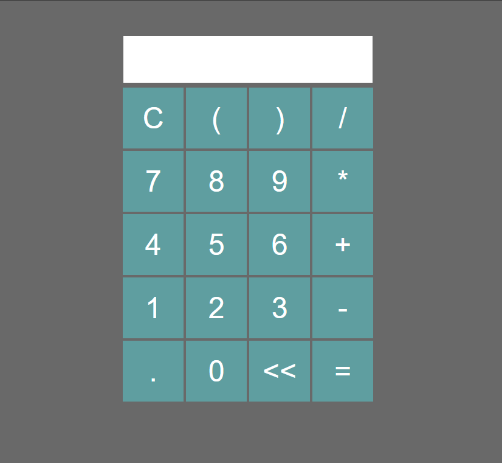

# Calculadora-JavaScript

Uma simples calculadora desenvolvida usando html, css e um pouco de javaScript para implementar a funcionalidade de calculadora

<h1 align="left">
    <ul>
        <li><a href="https://developer.mozilla.org/pt-BR/docs/Web/HTML">🔗 Html</a></li>
        <li><a href="https://developer.mozilla.org/pt-BR/docs/Web/CSS">🔗 Css</a></li>
        <li><a href="https://developer.mozilla.org/pt-BR/docs/Aprender/JavaScript">🔗 JavaScript</a></li>
    </ul>
</h1>

    Clonar projeto: git clone https://github.com/PedroHenrique-git/Calculadora-JavaScript.git

